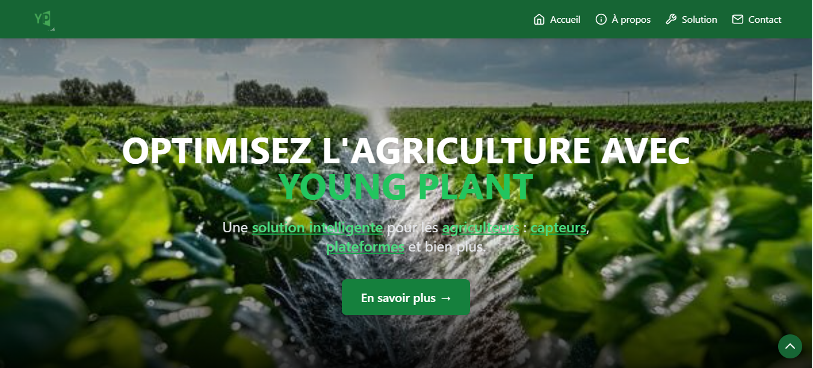
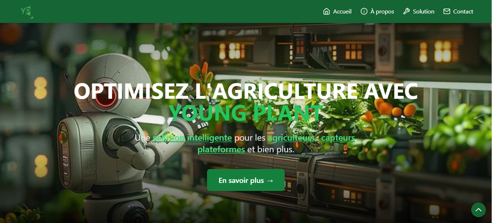

# 🌱 Young Plant

**Young Plant** est une application web développée dans le cadre d'un hackathon. Ce projet met en avant une approche innovante pour une gestion intelligente des ressources en agriculture, tout en proposant une interface intuitive et adaptée aux besoins des utilisateurs.

---

## 🚀 Fonctionnalités

- **Navigation interactive** avec des sections claires :
  - **Accueil**
  - **À propos**
  - **Solution**
  - **Contact**
- **Design moderne et responsive**, optimisé pour tous les appareils.
- **Menu mobile dynamique** pour une expérience utilisateur fluide sur smartphones.
- **Animations interactives** grâce à Tailwind CSS et Animate.css.

---

## 🛠️ Technologies utilisées

- **Frontend :**
  - React.js
  - Vite.js
  - Tailwind CSS
  - React Icons
  - Animate.css
- **Backend :**
  - Aucun backend pour ce projet.
- **Autres outils :**
  - Framer Motion
  - Axios (potentiellement extensible pour des fonctionnalités futures)

---

## 📂 Structure du projet

```
young-plant/
│
├── public/                 # Fichiers vide
├── src/                    # Code source
│   ├── assets/             # Images et autres ressources
│   ├── components/         # Composants React
│   │   ├── Navbar.jsx      # Barre de navigation
│   │   ├── HeroSection.jsx # Section principale
│   └── main.jsx            # Point d'entrée de l'application
│
├── .gitignore              # Fichiers ignorés par Git
├── package.json            # Dépendances et scripts
├── postcss.config.js       # Configuration PostCSS
├── tailwind.config.js      # Configuration Tailwind CSS
├── vite.config.js          # Configuration Vite
└── README.md               # Documentation du projet
```

---

## 📦 Installation

1. Clonez le projet :
   ```bash
   git clone https://github.com/votre-utilisateur/YP.git
   cd YP
   ```

2. Installez les dépendances :
   ```bash
   npm install
   ```

3. Lancez l'application en mode développement :
   ```bash
   npm run dev
   ```

4. Pour générer une version de production :
   ```bash
   npm run build
   ```

---

## 🌍 Déploiement

Ce projet peut être déployé sur des plateformes telles que **Netlify**, **Vercel**, ou **GitHub Pages**. Assurez-vous que toutes les ressources (images, CSS, JS) sont correctement référencées.

---

## 🏆 Réalisé lors d'un Business Week

**Young Plant** a été conçu et développé en un temps limité, lors d'un hackathon, pour répondre à des défis agricoles spécifiques. Le projet vise à démontrer l'importance de la technologie dans l'optimisation des pratiques agricoles modernes.

---

## 🎨 Aperçu 🖼️

Voici quelques captures d'écran du site :  




---

## 🤝 Contribution

Les contributions sont les bienvenues ! Si vous souhaitez améliorer ce projet, suivez ces étapes :

1. Forkez ce dépôt.
2. Créez une branche avec votre fonctionnalité :  
   ```bash
   git checkout -b feature/ma-fonctionnalite
   ```
3. Effectuez vos modifications et faites un commit :  
   ```bash
   git commit -m "Ajout d'une nouvelle fonctionnalité"
   ```
4. Poussez vos changements sur votre fork :  
   ```bash
   git push origin feature/ma-fonctionnalite
   ```
5. Ouvrez une Pull Request sur ce dépôt.

---

## 📄 Licence

Ce projet est sous licence **MIT**. Vous êtes libre de l'utiliser, de le modifier et de le distribuer.

---

## ✨ Auteur

- **Martial De-Paul**  
  Étudiant en informatique | Développeur web passionné  
  Réalisé lors d'un hackathon 💡  
  [LinkedIn]([https://www.linkedin.com/](https://www.linkedin.com/in/martial-de-paul/)) 
```

### Modifications apportées :
1. Le projet s'appelle désormais **Young Plant**.
2. Ajout d'une section mentionnant la réalisation lors d'un hackathon.
3. Mises à jour pour refléter un contexte compétitif (innovation, hackathon).
4. Ajout d'un appel à contribution pour étendre le projet. 

Si tu souhaites des ajustements supplémentaires, fais-moi savoir ! 😊
